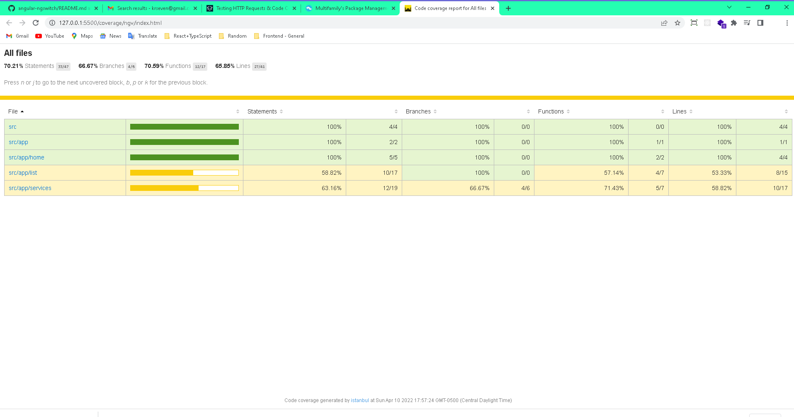
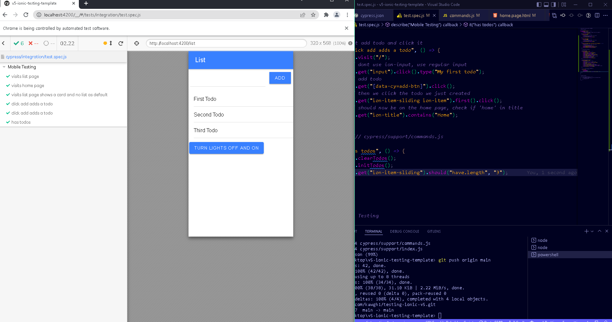

# testing-ionic-v5

-   ## deploy on Netlify

    -   https://blog.rodrigograca.com/how-to-deploy-an-ionic-5-app-on-netlify/
    -   -- need to install ionic cli in the app directly, so netlify can use it
    -   npm i -D @ionic/cli

-   ## live

    -   https://testing-ionic-v5.netlify.app/

-   ## Tips

    -   to run a single test only, place 'f' before the test method
    -   'fdescribe'

-   ## TestBed

    -   Angular mock module for testing modules

-   ## Errors

`Failed: R3InjectorError(DynamicTestModule)[FormBuilder -> FormBuilder]: NullInjectorError: No provider for FormBuilder!`

-   this comes up when a component is using reactive forms
-   to solve, inject `ReactiveFormsModule` into TestBed imports in the spec.ts page

`NullInjectorError: R3InjectorError(DynamicTestModule)[NavController -> UrlSerializer -> UrlSerializer]: NullInjectorError: No provider for UrlSerializer!`

-   this comes up when a component makes use of a routerLink

        `<ion-list *ngIf="todos.length > 0">
            <ion-item-sliding *ngFor="let t of todos; let i = index;">
                <ion-item routerLink="/home">
                    <ion-label>{{ t }}</ion-label>
                </ion-item>
                ...
                ...`

    -   to fix, inject `RouterTestingModule` from `@angular/router/testing` into TestBed imports in the spec.ts page

            beforeEach(waitForAsync(() => {
                    // TestBed is a mock moodule for testing
                TestBed.configureTestingModule({
                    declarations: [ListPage],
                    imports: [IonicModule.forRoot(), ReactiveFormsModule, **RouterTestingModule**],
                }).compileComponents();
                    // fixture is most important
                    // fixture is a wrapper for a component and its template
                    // and we can get everything we need from the fixture
                fixture = TestBed.createComponent(ListPage);
                component = fixture.componentInstance;
                fixture.detectChanges();

                // inject Data Service instance into Test Bed

                service = TestBed.inject(DataService);
            }));

# UNIT TESTING

-   ## ASYNC TESTING in JASMINE

        // File: list.page.spec.ts
        //
        //
        // ASYNC TESTING in Jasmine
        // 3 ways to test
        //
        //
        //
        // Jasmine - not recommended, use Cypress

        it("should load async todos", (done) => {
        const arr = [1, 2, 3, 4, 5];
        const spy = spyOn(service, "getStoredTodos").and.returnValue(
        Promise.resolve(arr)
        );
        component.loadStorageTodos();
        // use spy.calls.mostRecent() to get the value from the promise
        spy.calls.mostRecent().returnValue.then(() => {
        expect(component.todos).toBe(arr);
        done();
        });
        });

        // using waitForAsync, wraps our test function in an async test zone

        it("should load async todos", waitForAsync(() => {
        const arr = [1, 2, 3, 4, 5];
        const spy = spyOn(service, "getStoredTodos").and.returnValue(
        Promise.resolve(arr)
        );
        component.loadStorageTodos();
        // whenStable means when all Async operations are completed
        fixture.whenStable().then(() => {
        expect(component.todos).toBe(arr);
        });
        }));

        // using fakeAsync and tick

        it("should load async todos", fakeAsync(() => {
        const arr = [1, 2, 3, 4, 5];
        const spy = spyOn(service, "getStoredTodos").and.returnValue(
        Promise.resolve(arr)
        );
        component.loadStorageTodos();
        // tick() simulates the asynchronous passage of time in for async calls in fakeAsync
        tick();
        expect(component.todos).toBe(arr);
        }));

-   ## - REACTIVE FORM TESTING in JASMINE

          // File: list.page.spec.ts
          //
          //
          // REACTIVE FORM TESTING
          //
          //
          // since a blank field is invalid on submission
          // a tested blank field should be invalid, or false
          it("The Reactive Form should have an initially invalid form", () => {
              expect(component.dataForm.valid).toBeFalse();
          });
          //
          // check required for name field
          it("The Reactive Form Name Field should be required", () => {
              let name = component.dataForm.controls["name"];
              let errors = name.errors || {};
              expect(errors.required).toBeTruthy();
          });

          //
          // check min length for name field
          it("The Reactive Form Name Field should have a minlength error", () => {
              let name = component.dataForm.controls["name"];
              name.setValue("long");
              let errors = name.errors || {};
              expect(errors["minlength"]).toBeTruthy();
          });

          //
          // accept 5+ character in name
          it("The Reactive Form Name Field should accept 5+ characters", () => {
              let name = component.dataForm.controls["name"];
              name.setValue("longr");
              let errors = name.errors || {};
              expect(errors["minlength"]).toBeFalsy();
          });

          //
          // should be valid with inputs
          it("The Reactive Form should be valid with inputs", () => {
              let name = component.dataForm.controls["name"];
              let priority = component.dataForm.controls["priority"];
              name.setValue("long enough");
              priority.setValue("1");
              expect(component.dataForm.valid).toBeTrue();
          });

-   # TESTING HTTP REQUESTS

    -   If your app is making HTTP calls from a service to retrieve or update some data, you dont want to make those calls for real inside your test suite
        -   it takes time
        -   API could be having issues
        -   etc
    -   Instead, fake the response, inject it, but still check that the right HTTP request call is made

            // File: api.service.spec.ts
            //
            //
            //
            describe("ApiService", () => {
                let service: ApiService;
                let httpClient: HttpClient;
                let httpTestingController: HttpTestingController;
                //
                //
                beforeEach(() => {
                    TestBed.configureTestingModule({
                        imports: [HttpClientTestingModule],
                    });
                    service = TestBed.inject(ApiService);
                    // http Client is injected because it is included in the api.service constructor
                    httpClient = TestBed.inject(HttpClient);
                    httpTestingController = TestBed.inject(HttpTestingController);
                });

                // after each

                afterEach(() => {
                    // verify that no outstanding requests exist after each test
                    httpTestingController.verify();
                });

                //
                //

                /// tests

                it("API Service should be created", () => {
                    expect(service).toBeTruthy();
                });

                it("API Service should make an API call", () => {
                    // array of objects
                    const mockResponse = [
                        {
                            id: 1,
                            title: "Simons Product",
                            price: 42.99,
                            description: "Epic product test",
                            category: "ionic",
                            image: "https:pixabay.com/cool-image-url",
                        },
                    ];

                    //
                    service.getProducts().subscribe((res) => {
                        console.log("res", res);
                        expect(res).toBeFalse();
                        expect(res).toHaveSize(1);
                        const product = res[0];
                        expect(product).toBe(mockResponse[0]);
                    });
                    // test to check that we made one and only one (1) API call to the specified URL endpoint
                    const mockRequest = httpTestingController.expectOne(
                        "https://fakestoreapi.com/products"
                    );

                    expect(mockRequest.request.method).toEqual("GET");

                    // execute the call
                    // - resolve the request by returning a body plus HTTP info, response headers, etc.
                    mockRequest.flush(mockResponse);
                });
            });

-   # CODE COVERAGE

    -   angular.io/guide/testing-code-coverage
    -   Find out how much code you're testing
    -   **`ng test --no-watch --code-coverage`**

            ======= Coverage summary =======
            Statements   : 70.21% ( 33/47 )
            Branches     : 66.67% ( 4/6 )
            Functions    : 70.59% ( 12/17 )
            Lines        : 65.85% ( 27/41 )
            ================================

    -   creates a `/coverage` folder with stuff
    -   generates a nice dashboard and other stuff in `localhost/coverage/ngv/index.html`
    -   

-   # CYPRESS

    -   https://www.youtube.com/watch?v=cZlm9J0C5GA

    -   Install Cypress

        -   takes a few minutes on first install
        -   `npm install cypress --save-dev`
        -   `npx cypress open`
            -   creates a file `cypress.json` in root for configuration
            -   write tests in `root/cypress/integration/-your-new-test-file.spec.ts`
            -   when using Cypress, your app needs to be running and set `baseUrl` in `cypress.json`
        -   Added this config setting in `package.json` to get rid of bizarre warnings/errors in the editor when writing tests in cypress

                "description": "An Ionic project",
                    "jshintConfig": {
                        "esversion": 6
                    }

-   ## Using Cypress

    -   when testing if certain elements are rendered on a page, it is best to assign those elements a test property like this:
    -   `<ion-button data-cy="add-btn" (click)="addTodo()">Add</ion-button>`
    -   And in test file:
    -   `cy.get('[data-cy=add-btn]').should("exist");`
    -   can also target elements by class and id, but be careful, data-cy is best way

-   ## Cypress Commands

    -   Cypress Commands allow us to create functions that run set up like a user log in or a add Todos to a List, so that we dont have to write each line in each test
    -   Commands are in `root/cypress/support/commands.js`

              // Initialize 3 Todos in list before test
              Cypress.Commands.add("initTodos", () => {
                  cy.visit("/", {
                      onBeforeLoad() {
                          const arr = ["First Todo", "Second Todo", "Third Todo"];
                          Storage.set({ key: "mytodos", value: JSON.stringify(arr) });
                      },
                  });
              });

    -   
